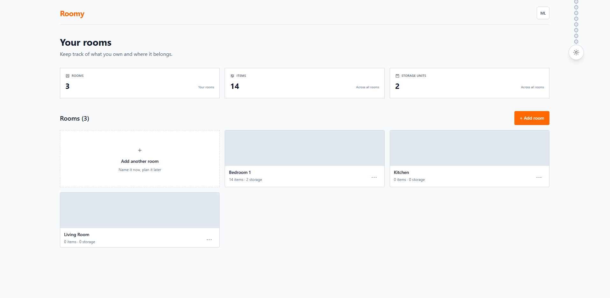
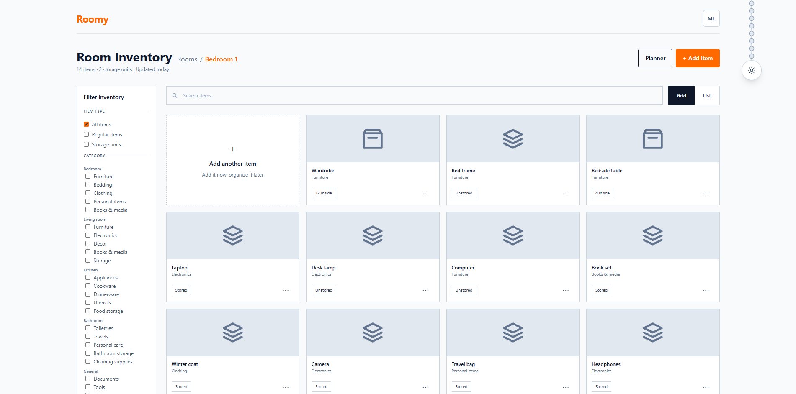

# Roomy

Roomy is a personal room inventory and approximate 2D layout-planning web
application. It helps people record belongings, remember where items are
stored, and organise rooms while rearranging or decorating their space.

> **Current progress:** The Week 1 implementation is a working React frontend
> demo. It currently saves room and item data in the browser, while the
> Express API, PostgreSQL database, authentication, and deployed services are
> planned for the next development stages.

**Live site:** Not deployed yet
**API:** Not connected yet
**Demo video:** To be added

## What it does

Roomy is designed for people who want a visual and organised way to keep track
of belongings in bedrooms and other personal rooms. Users can create rooms,
record items, identify storage relationships, search an inventory, and preview
basic item dimensions for future room-planning features.

## Built with

### Current frontend

- React 18
- Vite 6
- Tailwind CSS 4
- Browser `localStorage` for the current demo data

### Planned application stack

- Node.js and Express for the API
- PostgreSQL for persistent application data
- Supabase Auth for user authentication
- Vercel or another suitable host for deployment

The planned backend and authentication services are not connected to the Week 1
frontend yet.

## Setup and installation

### Requirements

- Node.js 18 or newer
- npm
- Git

The current demo does not require PostgreSQL, Supabase, or an API server.

### Clone and install

```powershell
git clone https://github.com/Matt-CRL/roomy.git
cd roomy\client
npm install
Copy-Item .env.example .env
```

On macOS or Linux, use `cp .env.example .env` instead of `Copy-Item`.

## Demo mode

The current application is intentionally running as a browser-only demo. Room
and item state is held in React and persisted to the visitor’s local storage,
so the interface can be developed and demonstrated before the real API and
database are available.

This is not the final architecture. The finals version should connect the
frontend to the Express API, PostgreSQL, and authentication services so data is
private to a signed-in user and available across sessions and devices.

## Running it yourself

From the `client/` directory, run:

```powershell
npm run dev
```

Open the address printed by Vite, normally:

```text
http://localhost:5173
```

The first screen opens the Bedroom 1 inventory. Use the navigation to visit
the Rooms page, enter a room, add or edit items, and switch between grid and
list views.

To verify that the production build works:

```powershell
npm run build
npm run preview
```

## Environment variables

The current Roomy screens work without custom environment variables. The
following variables are included for the planned API integration:

| Variable | Example value | Purpose |
| --- | --- | --- |
| `VITE_USE_MOCK_API` | `true` | Keeps the starter API adapter in demo mode. |
| `VITE_API_BASE_URL` | `http://localhost:3000` | The future Express API base URL. |

Values beginning with `VITE_` are compiled into the frontend and are public.
Never put passwords, database connection strings, or private keys in them.

There is currently no database setup or seed command for the Roomy data model.
The `server/` directory still contains the template Express/PostgreSQL
scaffold and will be replaced with Roomy endpoints in a later milestone.

## Features and usage

### Rooms

- View room, item, and storage summaries.
- Add a room with a custom name.
- Enter a room by double-clicking its room card.
- Rename or delete a room from its three-dot menu.
- Deleting a room also removes the items assigned to it after confirmation.

### Room inventory

- Add an item to the selected room.
- Edit an item’s name, category, notes, storage status, and planner dimensions.
- Move an item to another room.
- Delete an item after confirmation.
- Search items by name, category, or storage information.
- Filter between all items, regular items, and storage units.
- Filter by room-related categories such as bedroom, living room, kitchen,
  bathroom, and general items.
- Switch between grid and list views.
- Open an item focus preview by selecting an inventory card.
- Open a storage unit’s separate inventory sidebar to view stored items.

### Item form and planner preview

- Item names are limited to 80 characters.
- Notes are limited to 500 characters.
- Width and depth values update the basic rectangle preview.
- Width and depth cannot be set below 1 cm.
- Storage units display their stored-item count.
- Regular items display whether they are stored or unstored.

### Theme

Use the light-switch control at the top-right of the page to toggle between
Light mode and Night mode.

### Current data behavior

Room and item changes are saved to the current browser’s `localStorage`. They
are not shared with other browsers or users and are not yet stored in
PostgreSQL. Clearing the site’s local storage resets the demo data.

### API status

No Roomy inventory API endpoints are currently used by the frontend. The
`client/src/api/` and `server/` folders still contain starter adapter/scaffold
code from the class template; the existing `/api/sightings` routes are not
Roomy features. Planned Roomy endpoints will be documented here once the real
API is implemented.

## Deploying

Roomy is not deployed yet. Week 1 development is intended to run locally in
demo mode using `npm run dev`.

The repository contains a deployment workflow inherited from the class
template, but it has not been configured as the project’s final deployment.
Before deployment, the project still needs a working API, a hosted PostgreSQL
database, authentication configuration, environment variables, and a verified
production build. The live site, API, and demo video links will be added here
after they exist.

## Project structure

```text
client/
  src/
    App.jsx                 Main application state and page switching
    pages/                  Rooms, inventory, item form, and related screens
    components/             Reusable room, item, layout, and common UI pieces
    assets/                 Local fallback icons and images
    api/                    Starter API adapter kept for the future backend
  .env.example              Frontend environment variable template
  package.json              Frontend scripts and dependencies
server/                     Starter Express/PostgreSQL scaffold; not connected yet
docs/                       Planning notes and project documentation
.github/workflows/          Deployment workflow inherited from the template
AI-USAGE.md                 Record of AI assistance and project decisions
```

## Architecture

The current Week 1 flow is intentionally simple:

```text
React/Vite/Tailwind frontend
            |
            v
   React state in App.jsx
            |
            v
     Browser localStorage
```

The planned production flow is:

```text
React/Vite/Tailwind frontend
            |
            v
       Express API
        /       \
       v         v
 PostgreSQL   Supabase Auth
```

The frontend will eventually call the Express API for rooms and inventory.
The API will validate requests and read or write PostgreSQL, while Supabase
Auth will provide user authentication. The final hosting arrangement will be
selected when the backend is implemented.

## Screenshots

### Rooms page



### Room inventory



These screenshots show the current Week 1 frontend demo running with the
browser-based sample data.

## Known issues and next steps

- The frontend currently uses browser `localStorage` instead of a shared
  PostgreSQL database.
- User registration, login, and Supabase authentication are not implemented.
- The Express server is still the class template scaffold and does not expose
  Roomy room or inventory endpoints.
- The planner button and dimension preview are prototypes; the full movable 2D
  room planner is not implemented yet.
- Image upload and persistent image storage are not implemented.
- The app has not been deployed to a production frontend, API, or database.
- A final screenshot and deployment links still need to be added to this README.

Next development priorities are to define the Roomy database schema, implement
the room and inventory API, connect the frontend to PostgreSQL, add
authentication, and then build the full planner workflow.

## What I would do next

1. Define the Roomy database schema and API contract for users, rooms, items,
   and storage relationships.
2. Replace the browser-only state with Express and PostgreSQL while keeping the
   current interface working.
3. Add Supabase authentication, complete the movable 2D planner, and deploy
   the frontend and backend for the final demonstration.

## Author

Matt Christian R. Lara
Bachelor of Science in Computer Science, CS-404

## Documentation

- [Project proposal and design notes](docs/README.md)
- [AI usage record](AI-USAGE.md)
- [Class starter instructions](START-HERE.md)

## AI use

This project was built with AI assistance. The detailed record of prompts,
changes, decisions, and corrections is available in
[AI-USAGE.md](AI-USAGE.md).


## License

MIT, see [LICENSE](https://github.com/Matt-CRL/roomy/blob/main/LICENSE).
