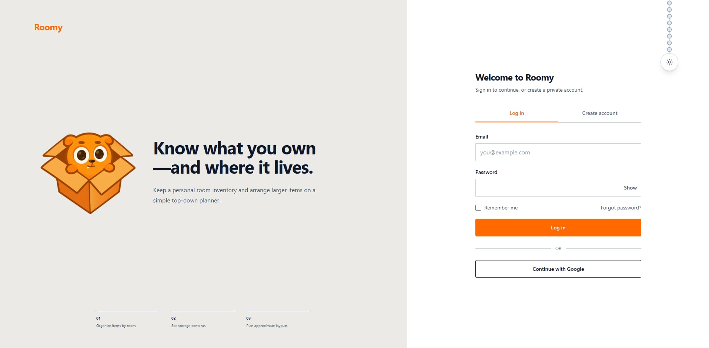
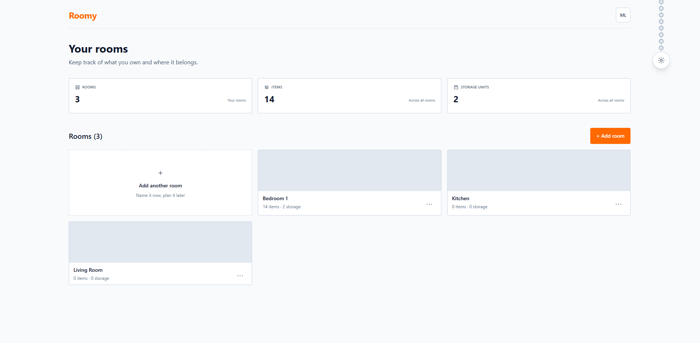
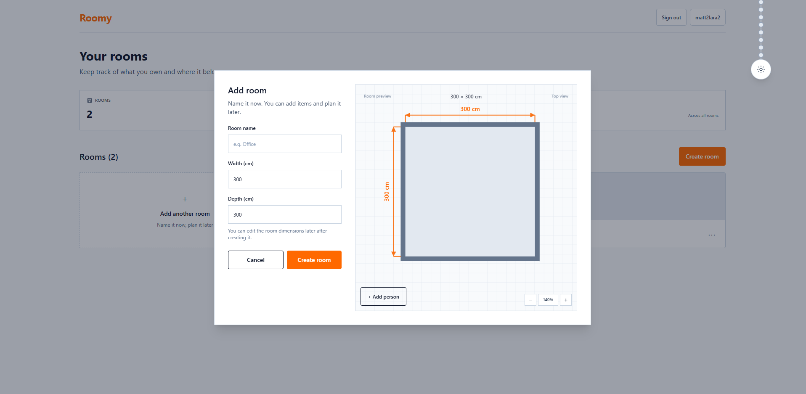
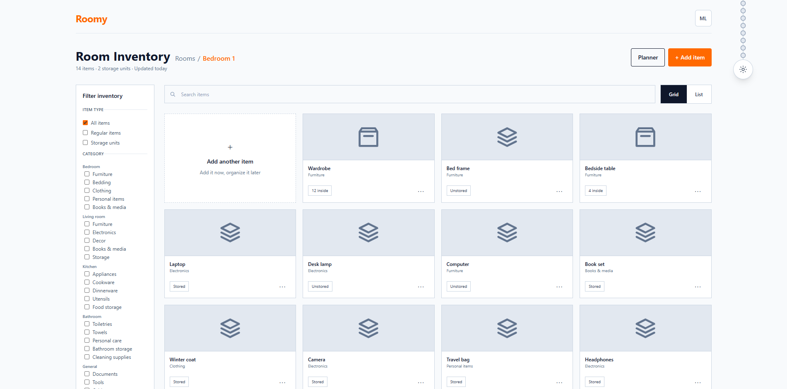
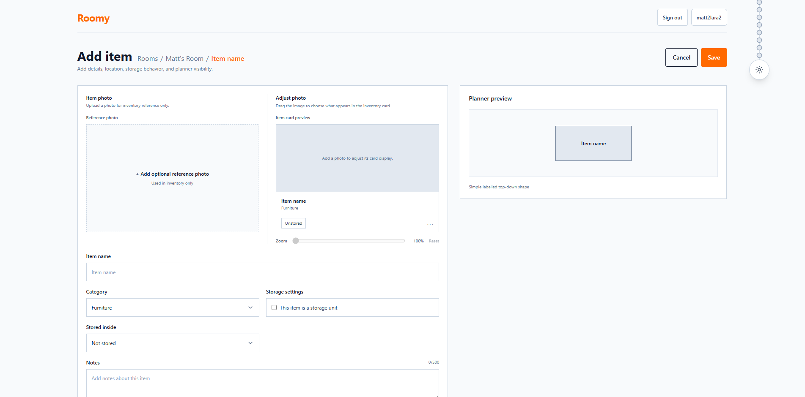

# Roomy

Roomy is a personal room inventory and approximate 2D layout-planning web
application. It helps people record belongings, remember where items are
stored, and organise rooms while rearranging or decorating their space.

> **Status — 2026-10-09:** Roomy is deployed on Vercel, with Supabase providing
> authentication, PostgreSQL, and private photo storage. The `roomy-production`
> database passed the runtime and photo-maintenance security preflight. The owner
> has manually confirmed core live workflows, including sign-in, saved data,
> planner changes, photos, and storage actions. This is smoke-test evidence, not
> a complete production audit: backup/recovery, scheduled cleanup, and some
> hosting-security and accessibility checks still need verification.

**Live site:** [roomy-tawny.vercel.app](https://roomy-tawny.vercel.app/)
**API:** [roomy-api.vercel.app](https://roomy-api.vercel.app/)

## Start here

- To explore the interface without an account or database, follow
  [Quick start: demo mode](#quick-start-demo-mode).
- To work on authentication, saved account data, or photos, follow
  [Run with Supabase and PostgreSQL](#run-with-supabase-and-postgresql).
- To change the application, see [Working on Roomy](#working-on-roomy).
- For request bodies and validation rules, see the
  [backend API documentation](docs/backend.md).

## What it does

Roomy is designed for people who want a visual and organised way to keep track
of belongings in bedrooms and other personal rooms. Users can create rooms,
record items and photos, identify storage relationships, search an inventory,
and arrange labelled shapes in a saved 2D room layout. The planner supports
moving, resizing, rotating, appearance settings, undo/redo, and automatic saves.

## Built with

### Frontend

- React 18
- Vite 6
- Tailwind CSS 4
- Browser `localStorage` for demo mode; Supabase Auth and Express API in real mode

### Backend

- Node.js 20+, Express, PostgreSQL, and `pg`
- Supabase for PostgreSQL hosting, email/password authentication, and private photos
- Vercel Hobby, with separate frontend and API projects

The real mode uses the Express API for inventory and layouts. External services
must be configured before that mode can run.

## Quick start: demo mode

### Requirements

- Node.js 20 or newer (tested locally with Node.js 24)
- npm
- Git

Demo mode needs only the client. It does not require an account, PostgreSQL,
Supabase, or an API server.

### Clone and install

```powershell
git clone https://github.com/Matt-CRL/roomy.git
cd roomy\client
npm ci
Copy-Item .env.example .env
npm run dev
```

These commands assume a new checkout. If `.env` already exists, keep it and
edit its values rather than copying over it. On macOS or Linux, use
`cd roomy/client` and `cp .env.example .env`.

### How demo mode works

Demo mode is an optional browser-only path for developing or demonstrating the
interface without PostgreSQL, Supabase, or an API server. Room and item state
is held in React and persisted to the visitor’s local storage. It is separate
from each real account and is not imported automatically.

Set `VITE_USE_MOCK_API=true` in `client/.env` for local demo mode. Production
release builds reject demo mode and require the real API/Auth configuration;
use `npm run build:demo` only when an intentional demo artifact is wanted.

Open the address printed by Vite, normally:

```text
http://localhost:5173
```

In demo mode, the first screen opens the Bedroom 1 inventory. A new real
account opens the Rooms page so the user can create their first room. Visit
Rooms, enter a room, add or edit items, and switch between grid and list views.

To build an intentional browser-only demo:

```powershell
npm run build:demo
npm run preview
```

`npm run build` is a release build. It fails unless real mode is explicitly
selected, the API/Auth URLs use valid public HTTPS endpoints, and the Supabase
browser key is a valid publishable or supported legacy anon key.
This prevents an unset or mistyped mode from publishing a demo as production.

## Run with Supabase and PostgreSQL

Use your own development Supabase project, not someone else's credentials or
a database containing important data. This mode needs both the client and
server. From the repository root, install the server dependencies and create
its environment file if it does not already exist:

```powershell
cd server
npm ci
Copy-Item .env.example .env
```

If you skipped the demo quick start, also install the client dependencies and
copy `client/.env.example` to `client/.env`. All commands below assume the
repository has already been cloned.

1. Create a Supabase project. Enable email/password authentication and create
   a **private** Storage bucket named `roomy-item-photos`. Keep the database
   password and secret key out of Git.
2. In `server/.env`, set `DATABASE_URL`, `PHOTO_CLEANUP_DATABASE_URL`,
   `SUPABASE_URL`, `SUPABASE_PUBLISHABLE_KEY`, and `SUPABASE_SECRET_KEY` as
   described in [the security rollout runbook](server/SECURITY-ROLLOUT.md).
   Keep the migration credential out of this runtime file and the running API.
3. In `client/.env`, set `VITE_USE_MOCK_API=false`, `VITE_API_BASE_URL`,
   `VITE_SUPABASE_URL`, and `VITE_SUPABASE_PUBLISHABLE_KEY`.
   The client and server must use the same Supabase project. For local use,
   set `VITE_API_BASE_URL=http://localhost:3000`,
   `CORS_ORIGINS=http://localhost:5173`, and `NODE_ENV=development`.
4. Follow the role setup and migration procedure in
   [the security rollout runbook](server/SECURITY-ROLLOUT.md). Before applying
   reviewed migrations, copy `server/.env.migrate.example` to
   `server/.env.migrate`, set its migration and runtime database URLs, then run
   `npm run db:migrate` from `server/`. This separate ignored file is not loaded
   by the API. The migration runner tracks applied files and does not seed or
   erase user data.
5. From `server/`, run `npm run db:preflight` to check database permissions
   without changing data. Resolve any reported issues before relying on the
   security setup.
6. In one terminal, run `npm run dev` from `server/`. In another, run
   `npm run dev` from `client/`. Open `http://localhost:5173` and sign up.

If Supabase requires email confirmation, use the link it emails you before
signing in. The first real account starts with no rooms. Add a room with width
and depth in centimeters, then add items. `/healthz` checks the API process;
`/readyz` checks the database role, RLS flags/policies, and runtime grants. It
intentionally returns unavailable until the restricted runtime setup is
complete. Database role setup is an administrative step: copying the example
environment file alone does not create those roles or set their passwords.

## Environment variables

Copy the placeholders from [client/.env.example](client/.env.example) and
[server/.env.example](server/.env.example), then replace them with your own
settings. `VITE_` variables belong in `client/.env`; all other variables below
belong in `server/.env`. Demo mode needs only `VITE_USE_MOCK_API=true`.

| Variable | Example value | Purpose |
| --- | --- | --- |
| `VITE_USE_MOCK_API` | `false` | Release builds require exact `false`; use `npm run build:demo` for an intentional demo. |
| `VITE_API_BASE_URL` | `https://api.example.com` | Public Express API origin; HTTPS required for release builds. |
| `VITE_SUPABASE_URL` | `https://your-project.supabase.co` | Public Auth project URL. |
| `VITE_SUPABASE_PUBLISHABLE_KEY` | `sb_publishable_...` | Public browser key; never use a server secret/service key here. |
| `DATABASE_URL` | Restricted runtime connection | Server-only PostgreSQL login; not an owner or RLS-bypass role. |
| `MIGRATION_DATABASE_URL` | `server/.env.migrate` only | Administrative connection for reviewed migrations; never put it in the API `.env`, a host runtime, or a `VITE_` variable. |
| `PHOTO_CLEANUP_DATABASE_URL` | Restricted cleanup connection | Separate worker login limited to the photo cleanup table. |
| `DATABASE_SSL_CA_FILE` | `C:\path\outside-repo\supabase-ca.pem` | Optional local path to the database root certificate for verified TLS. |
| `DATABASE_SSL_CA` | PEM certificate contents | Optional backend-only certificate value for hosted verified TLS; use this on Vercel instead of a local file path when needed. |
| `SUPABASE_URL` | `https://your-project.supabase.co` | Server's Auth and Storage project URL. |
| `SUPABASE_PUBLISHABLE_KEY` | `sb_publishable_replace_me` | Server's public Auth project key. |
| `SUPABASE_SECRET_KEY` | `sb_secret_replace_me` | Server-only key for private photo storage. |
| `SUPABASE_PHOTO_BUCKET` | `roomy-item-photos` | Private Storage bucket name. |
| `CORS_ORIGINS` | `https://roomy.example.com` | Comma-separated allowed frontend origins; production requires HTTPS. |
| `NODE_ENV` | `development` | Runtime mode; use `production` on a host. |
| `PUBLIC_HTTPS` | `true` | Confirms production HTTPS at the host/proxy and enables HSTS. |
| `CRON_SECRET` | Random value, at least 32 characters | Backend-only authorization for Vercel's scheduled photo-cleanup request. |
| `PORT` | `3000` | Optional local API port; hosting providers normally set it. |

`PUBLIC_HTTPS` is for a production HTTPS host, not the local HTTP server.
The cleanup connection is required in production and for the full database
preflight. Supply a certificate only when the database certificate is not
already trusted; Vercel requires PEM contents rather than a path on your PC.

Values beginning with `VITE_` are compiled into the frontend and are public.
Never put passwords, database connection strings, or private keys in them.

Do not put `DATABASE_URL` or `SUPABASE_SECRET_KEY` in `client/.env`. Vite embeds
all `VITE_` values at build time. The Supabase publishable key is designed to
be public; database credentials, secret keys, access tokens, and passwords are
not.

## Deploying on Vercel

Roomy is deployed as two Vercel projects connected to this repository:

| Vercel project | Root directory | Build | Output / runtime |
| --- | --- | --- | --- |
| Frontend — `roomy` | `client` | `npm run build` | Static Vite output in `dist`; `client/vercel.json` provides SPA route rewrites and browser security headers. Live at [roomy-tawny.vercel.app](https://roomy-tawny.vercel.app/). |
| API — `roomy-api` | `server` | Vercel Express detection | Express app exported by `server/index.js` as a Vercel Function; `server/vercel.json` schedules photo cleanup. Base URL: [roomy-api.vercel.app](https://roomy-api.vercel.app/). |

The API URL is for app requests, not a user-facing webpage; opening it directly
may return a route or JSON response.

The live projects use environment variables configured in the Vercel dashboard.
For a new deployment, add the frontend's four `VITE_` values as build
environment variables. Add database URLs, Supabase server credentials, the exact
frontend origin in `CORS_ORIGINS`, `PUBLIC_HTTPS=true`, and `CRON_SECRET` only to
the API project. Keep `MIGRATION_DATABASE_URL` off the API host. Configure
preview environments intentionally; preview URLs may be publicly reachable and
must not receive production secrets by default. Never copy real values into this
repository or a frontend variable.

The API processes a small photo-cleanup batch after successful changes and
Vercel retries the remaining durable queue daily. Hobby runs cron once a day,
with up to 59 minutes of scheduling variation; the actual scheduled invocation
still needs to be observed. Image uploads are limited to 4 MiB to stay under
Vercel's function request-size limit. Supabase Auth email delivery is configured
and recovery-email delivery has been observed. Full confirmation/recovery-flow
coverage, backups, actual response headers, and other remaining checks are listed
under [Known issues and next steps](#known-issues-and-next-steps).

## Features and usage

### Authentication

- Real mode supports email/password sign-up and sign-in through Supabase Auth.
- Users can request a password-reset email and set a new password from its
  recovery link. Configure the allowed redirect URLs in Supabase for each
  environment. Recovery-email delivery has been observed on the live service;
  complete end-to-end confirmation and recovery testing remains to be recorded.

### Rooms

- View room, item, and storage summaries.
- Add a room with a custom name and width/depth in centimeters, including up
  to two decimal places. The room preview supports adjusting its dimensions.
- Enter a room by double-clicking its room card on desktop or tapping it on mobile.
- Rename or delete a room from its three-dot menu.
- Deleting a room also removes the items assigned to it after confirmation.
- Room cards show the saved planner layout, item/storage counts, and the last
  updated date and time, or creation time when no layout has been saved.

### Room inventory

- Add an item to the selected room.
- Edit an item’s name, category, notes, storage status, and planner dimensions.
- Move an item to another room.
- Delete an item after confirmation.
- Search items by name, category, or storage information.
- Filter between all items, regular items, and storage units.
- Filter by grouped categories such as Furniture & decor, Electronics,
  Clothing & personal, Kitchen, Books & documents, and Storage & household.
- Switch between grid and list views.
- Open an item focus preview by selecting an inventory card.
- Open a storage unit’s separate inventory sidebar to view stored items.
- Store or unstore items from their menus. Storage choices include thumbnails;
  storage units cannot be placed inside other storage units.
- Add available unstored items from an open storage inventory, or unstore its
  contents directly. Empty states explain when no unstored items are available.
- List rows include item thumbnails alongside the name and category.

### Item form and planner preview

- Item names are limited to 80 characters and notes to 500, with character
  counters. Notes and planner adjustments are optional.
- Choose a category and storage relationship; selecting a storage unit
  disables the Stored inside field and explains why.
- Upload a JPEG, PNG, or WebP photo (up to 4 MiB), then adjust its crop and zoom
  while previewing the inventory card.
- The planner preview and settings share one card. Width, depth, and color
  match the planner's object appearance and can be adjusted there later.
- Planner item width and depth accept values with up to two decimal places.
- New planner objects default to 30 × 30 cm and color `#1d1b31`.
- Width and depth cannot be set below 1 cm.
- Storage units display their stored-item count.
- Regular items display whether they are stored or unstored.

### Room planner

- Place available unstored room items and storage units in a 2D layout.
  Stored items are represented through their storage unit's contents.
- Drag, resize, and rotate shapes; edit Size, Position, and Appearance in
  the inspector. Shapes are constrained to the room's dimensions.
- Pan and zoom the view, reset the view, and undo or redo layout edits.
- Add a temporary 50 × 30 cm person guide for scale; it is excluded from saves.
- Changes save automatically after a pause in editing. Save now remains
  available, with a last-saved time and feedback when a save fails.
- Saved layouts load when reopening the planner and appear in room previews.
  Saving updated dimensions also updates the room and placed item's dimensions.
- Layout revisions detect stale or simultaneous saves; a failed save keeps
  the local draft available for review.

### Theme

Use the light-switch control at the top-right of the page to toggle between
Light mode and Night mode. The themes use matching logos and background cursor
effects: a sticker trail in Light mode and a warm glow in Night mode. Effects
sit behind page content; the sticker trail is disabled in the planner.

### Data behavior

Demo changes are saved in the current browser’s `localStorage`. Real mode sends
them to PostgreSQL through Express and scopes every record to the signed-in
user. Switching modes does not transfer demo data into a real account.

### API routes

All `/api` routes require a Supabase access token in the `Authorization: Bearer`
header. `/healthz` and `/readyz` are public.

| Method | Path | Purpose |
| --- | --- | --- |
| GET, POST | `/api/rooms` | List rooms with counts; create a room. |
| GET, PATCH, DELETE | `/api/rooms/:roomId` | Read, rename/resize, or delete a room. |
| GET | `/api/categories` | List the fixed category choices. |
| GET, POST | `/api/rooms/:roomId/items` | Search/filter/paginate items; create one. |
| GET, PATCH, DELETE | `/api/items/:itemId` | Read, update, or delete an item. |
| GET | `/api/items/:itemId/contents` | List stored items and a confirmation version. |
| POST | `/api/items/:itemId/move` | Move an item to another room. |
| GET, PUT | `/api/rooms/:roomId/layout` | Load/save one room layout with a revision. |
| GET, POST, DELETE | `/api/items/:itemId/photo` | Download, upload, or remove a private photo. |
| DELETE | `/api/account` | Permanently delete the signed-in account and its Roomy data. |
| GET | `/api/cron/photo-cleanup` | Secret-protected Vercel job; not a browser endpoint. |

For a nonempty storage unit, move/delete requires `includeContents` and the
`contentsVersion` returned by the contents route. Including items moves or
deletes them with the storage unit. Excluding items leaves them unstored in
their original room. A changed version returns `409`, prompting a fresh review.
Requests use JSON except photo upload, which uses raw JPEG/PNG/WebP bytes.

For example, list the signed-in user's rooms using their Supabase session
access token:

```http
GET /api/rooms
Authorization: Bearer <user-access-token>
```

An absent or expired session returns `401`; an absent or unowned record
returns `404`; stale layout or storage decisions return `409`. Request
examples and validation details are in [docs/backend.md](docs/backend.md).

## Current deployment status

The frontend and API are deployed to Vercel and use the `roomy-production`
Supabase project. The GitHub Pages workflow is manual-only; pushes do not publish
the app there. Release builds require explicit real-mode configuration and the
public `VITE_` settings above. The production API requires restricted runtime
and maintenance roles.

The selected Supabase project, now named `roomy-production` (formerly
`roomy-test-qa`), passed `npm run db:preflight`; prior QA also verified two-account
API isolation, private photos, cleanup, and planner persistence. The owner has
since confirmed core workflows on the live site. The separate original Supabase
project is unchanged and is not the app's database. Deployment is live, but
backup/recovery, a real scheduled cleanup run, and complete host-level security
and browser checks remain outstanding.

## Project structure

```text
client/
  src/
    App.jsx                 Main application state and page switching
    pages/                  Rooms, inventory, item form, and related screens
    components/             Reusable room, item, layout, and common UI pieces
    assets/                 Local fallback icons and images
    api/                    Matching demo/HTTP adapters and Supabase Auth client
    utils/appBasePath.js    Root/subpath navigation helpers
  buildConfig.js            Release configuration validation
  tests/                    Build configuration and base-path checks
  .env.example              Frontend environment variable template
  package.json              Frontend scripts and dependencies
server/
  app.js                    Protected Roomy HTTP routes and errors
  index.js                  Express Function entry point for Vercel
  startup.js                Fail-closed production startup checks
  account.js                Protected account deletion and cleanup
  roomyRepo.js              Parameterized SQL and transactions
  auth.js                   Supabase session verification
  photos.js                 Private Storage operations and cleanup retry
  photoJobs.js              Bounded, lock-safe durable cleanup worker
  db/migrations/            Versioned Roomy schema
  db/migrate.js             Migration runner
  db/userContext.js         Transaction-local user identity and savepoints
  db/preflight-cli.js       Database role and policy checks
  tests/                    API, configuration, RLS, and transaction checks
  SECURITY-ROLLOUT.md        Role setup and production cutover procedure
docs/                       Planning notes and project documentation
.github/workflows/          Manual-only legacy GitHub Pages workflow
AI-USAGE.md                 Record of AI assistance and project decisions
```

## Architecture

Demo flow:

```text
React/Vite/Tailwind frontend
            |
            v
   React state in App.jsx
            |
            v
     Browser localStorage
```

Real mode flow:

```text
React/Vite/Tailwind frontend
            |
            v
       Express API ─────── Supabase Auth (verify session)
        /       \
       v         v
 PostgreSQL   private Supabase Storage
```

Express derives ownership from a verified session, validates requests, and
uses parameterized SQL for inventory and layouts. Each authenticated request
sets the user ID within its database transaction; nested work uses savepoints
on the same connection. Restricted database roles and owner-specific RLS
policies provide additional access checks. A separate maintenance login handles
photo cleanup jobs. Storage moves/deletions run in database transactions.
The planner saves logical coordinates measured in
centimeters against each room's specified width and depth; saving a resized
planner shape also updates that item's Width/Depth values.

## Working on Roomy

There is no root-level npm script: run commands inside `client/` or `server/`.
Keep the client and server in separate terminals during real-mode development.

| Change | Start with |
| --- | --- |
| Page layout, forms, or interactions | `client/src/pages/` and `client/src/components/` |
| App-wide state and page navigation | `client/src/App.jsx` |
| Demo data or API calls | `client/src/api/` |
| API routes and input validation | `server/app.js` and `server/roomyRepo.js` |
| Photos or account deletion | `server/photos.js` and `server/account.js` |
| Database schema | A new numbered file in `server/db/migrations/` |

For a change, create a branch, keep the scope small, and include a description
of how you tested it. Keep demo and real API behavior consistent when changing
data operations. Add a new migration for schema changes; do not rewrite a
migration that has already been applied to a shared database.

Before submitting changes:

```powershell
# From the repository root
cd server
npm test
cd ..\client
npm run test:config
npm run build:demo
```

The client tests currently cover configuration and routing helpers, not the
whole interface. Also check affected screens manually in both themes, at a
narrow screen width, and using the keyboard. For real-mode changes, check
authenticated behavior against your development database. A demo build does
not verify production configuration; run `npm run build` separately when
valid public HTTPS settings are available.

Never commit `.env` files, credentials, session tokens, or database exports.
Use placeholders in examples. Review your diff before committing, and record
AI-assisted work in [AI-USAGE.md](AI-USAGE.md) where applicable.

### Common setup problems

| Problem | What to check |
| --- | --- |
| Changes disappear or data seems different | Demo data belongs to the current browser; real data belongs to the signed-in account. Check `VITE_USE_MOCK_API`. |
| An existing account cannot sign in | Confirm the client points to the Supabase project where that account was created, and check email confirmation. |
| The browser cannot reach the API | Start the server, check `VITE_API_BASE_URL`, and make `CORS_ORIGINS` match the exact frontend origin printed by Vite. |
| Database security preflight fails | Follow the runbook's role and policy checks. Do not disable row-level security to work around the error. |
| Database certificate error | Locally configure the trusted database CA with `DATABASE_SSL_CA_FILE`; on Vercel use backend-only `DATABASE_SSL_CA` PEM contents. Never disable TLS verification. |
| A release build rejects localhost or demo mode | This is intentional. Use `npm run dev` locally or `npm run build:demo` for a demo artifact. |

Restart the client after changing its `.env`, and restart the server after
changing server settings. Rebuild the frontend when changing deployment
settings, because its environment values are included at build time.

## Verification and current progress

Recorded checks through **2026-10-09**:

| Check | Result |
| --- | --- |
| Server tests (`npm test` in `server/`) | 29 passed after Vercel preparation. |
| Client configuration tests (`npm run test:config` in `client/`) | 9 passed after Vercel preparation. |
| Client build | Demo and synthetic HTTPS real-mode builds passed after Vercel preparation. The live site is serving the deployed frontend. |
| Server production dependency audit | `npm audit --omit=dev` passed after updating the affected transitive dependency. |
| Database and API | The selected `roomy-production` project passed the runtime/photo-maintenance security preflight on 2026-10-08. Earlier QA on that project verified two-account isolation, private photos and cleanup, and planner persistence/conflict handling. |
| Live browser smoke test | The owner confirmed sign-in, persistence, planner changes, photos, and storage actions on the deployed app. This does not cover every workflow or device. |
| Authentication email | A recovery email was delivered through configured SMTP. Full sign-up confirmation and end-to-end recovery testing still need recorded results. |
| Production operations/security | Vercel deployment is live. Backup/recovery review, observation of a scheduled cleanup run, complete response-header/CORS checks, responsive and keyboard coverage remain pending. The separate original Supabase project is unchanged and is not the app database. |

Production verification remains incomplete for backups/recovery and several
host-level checks. Database role requirements and rollout details are documented
in the [security rollout runbook](server/SECURITY-ROLLOUT.md).

To rerun the local test suites:

```powershell
cd server
npm test
cd ..\client
npm run test:config
```

## Screenshots

### Authentication page



### Rooms page



### Add Room planner preview



### Room inventory



### Add Item form



These screenshots show the Roomy frontend; their freshness against the latest
interface still needs review. The live app is available at
[roomy-tawny.vercel.app](https://roomy-tawny.vercel.app/).

## Known issues and next steps

- The selected Supabase project (renamed `roomy-production`, formerly
  `roomy-test-qa`) passes the runtime/photo-maintenance preflight. The separate
  original Supabase project remains unchanged and is no longer the app target.
  Confirm database and Storage backup/recovery arrangements before relying on
  Roomy to keep important inventory data.
- The owner has smoke-tested core live workflows, but detailed coverage remains
  to be recorded for signup confirmation/password recovery, photo adjustment,
  planner drag/resize/rotate, undo/redo, autosave/manual save, and reload/error
  recovery.
- Responsive layouts, keyboard navigation, focus behavior, and both themes
  need further checks across desktop, tablet, and phone sizes.
- Database and Storage backup/recovery arrangements need confirmation; a real
  scheduled cleanup invocation and complete deployed response-header/CORS checks
  have not yet been recorded.
- Demo browser data is not imported into real accounts automatically.
- Screenshot freshness still needs review against the current live interface.

The remaining work is focused on closing these verification and operational
gaps; the frontend and API hosting are already deployed.

## Planned work

1. Record manual browser checks against the selected project, including authentication,
   inventory/storage, photos, planner interactions, saves, and error recovery.
2. Test mobile/tablet layouts, keyboard navigation, focus, and both themes;
   address any confirmed issues.
3. Refresh screenshots and update the backend documentation and AI usage record.
4. Confirm database and Storage backup/recovery coverage; record deployed
   security-header/CORS checks and observe a scheduled cleanup run.
5. Finish and record the remaining live browser checks, refresh screenshots and
   AI attribution as needed. Keep the demo video, slides, and presentation image
   outside this repository.
6. Explore optional AI assistance, such as suggesting item names or categories
   from a photo, answering natural-language questions about a user's inventory,
   or proposing planner layouts. Keep suggestions user-reviewed, and assess
   privacy and data handling before choosing or building any feature.

## Author

Matt Christian R. Lara
Bachelor of Science in Computer Science, CS-404

## Documentation

- [Project proposal and design notes](docs/README.md)
- [Backend API contract and setup](docs/backend.md)
- [AI usage record](AI-USAGE.md)
- [Database security setup and cutover](server/SECURITY-ROLLOUT.md)

## AI use

ChatGPT/Codex assisted with parts of the frontend, backend planning and
implementation, and code review. The dated record of prompts, decisions, and
corrections is available in
[AI-USAGE.md](AI-USAGE.md).


## License

MIT, see [LICENSE](https://github.com/Matt-CRL/roomy/blob/main/LICENSE).
